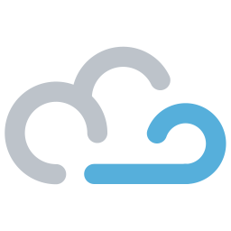

<div align="center">
<h1>Breeze – cloud native REPL</h1>
</div>

Breeze is a browser editor and REPL/terminal that connects to a dedicated Docker container on the server. It allows creating on-demand programming environments for your favourite programming language.dd

TODO: Screenshot

## "But wait, there is Theia, Eclipse Che, VS Codespaces, Coder, …?"
Yes, and Breeze should not replace them. All the mentioned Cloud-"Editors" are full-fledged IDEs packed with features and are customizable to the tiniest Button. Cloud IDEs are build for professional developers working on larger projects. Our main reason to build Breeze was giving first semester CS students a ready to go programming environment with a big green play button. 

Every first-year student spends many hours setting up a local programming environment on their computer. Everyone who went through this knows how error-prone and frustrating this can be. Students should focus on learning the basic principles of programming languages and not how to install a compiler and other tools or what are the keyboard shortcuts of IDE XYZ.

The urge of a more powerful and customizable development environment comes automatically with more knowledge of how things work. It is less scary to install a compiler on your own if you learned the basic principles of a programming language ecosystem.

## How Breeze works
Basically, we connect an editor and a terminal running in the browser with a Docker container on a server. That's it.

This architecture makes Breeze super flexible: Want to run Python? Just use the official Python Docker image and configure the compile/run and repl commands. This principle works for (mostly) all programming languages, and even with other tools like databases (MariaDB + `mysql` interpreter) or raw Ubuntu containers to teach e.g. Git or Bash.

## When would I need this?
Our main use-case is [Code FREAK](https://github.com/codefreak/codefreak), a web platform for coding education and automatic evaluation. With Breeze, we spin up a browser programming environment with pre-configured run settings. Students can program directly in the browser and do not have to initialize a local development environment.

Breeze could also be used to provide quick testing environments for new programming languages (code sandboxes).

## Show me a demo!
There is no public demo yet, but you can try Breeze locally with Docker. Here are some examples, all of them use official images from Docker Hub.

All the local demos will use the Docker daemon itself to spin up necessary sidecar containers. The UI is accessible
at `http://localhost:8080`.

### Python 3.8
```shell script
docker run --rm -it -v${PWD}:/workspace \
   -v /var/run/docker.sock:/var/run/docker.sock \
   -p 8080:8080 \
   cfreak/breeze \
   --image=python:3.8 \
   --main-file=main.py \
   --repl-cmd='python -i' \
   --run-cmd='python main.py'
```
`--image` tells Breeze which Docker image to use. The `--main-file` is a path relative to the working directory (default is `/workspace`). The main file will be created if it does not exist and is opened by default in the editor. `--repl-cmd` should be a command that starts an interactive session. `--run-cmd` is the command that will be executed if you press the green play button on the web UI. 

### Raw Ubuntu 20.04 LTS
```shell script
docker run --rm -it \
   -v /var/run/docker.sock:/var/run/docker.sock \
   -p 8080:8080 \
   cfreak/breeze \
   --image=ubuntu:20.04 \
   --repl-cmd=bash
```
Btw, the default `repl-cmd` is `/bin/sh`. This should work for many images, but some very slim images even remove the default shell. In these cases you need to build a custom image.

## How secure is Breeze?
The Breeze application itself is basically only a proxy between the Web UI and a Docker container. Breeze needs access to the Docker engine or K8s cluster via service accounts (upcoming feature). 

So if you ask about the security of Breeze the real question is: How secure are Docker containers? This is a very broad topic on its own. Docker only provides some level of logical isolation between the resources of processes. If you allow strangers to run arbitrary commands and software on you machines, you need to take additional security measurements: Limit resources (CPU, memory, disk, …), limit or better cut network/internet access and make sure the containers have no additional privileges.

Regarding resources Breeze is very strict by default: Containers have no network access, only 32MB RAM and a very low amount of available CPU cycles. Of course, you can tweak all of these parameters for your needs! Add more RAM, more CPU and allow internet access.

## FAQ
### Does Breeze support debugging?
No, and there are currently no plans to add debugging features.

### Do I need Docker?
Breeze supports three environments: `docker` (default), `k8s` and `local`. On Docker and Kubernetes (`k8s`) containers are created natively using the Docker/K8s API. The `local` environment uses the underlying host without a container. This requires all software (compiler, interpreter, etc.) to be installed on the system. The `local` env is only meant for testing and should never be used in production.

### Where are the files stored?
Breeze uses the filesystem of the container. If Breeze itself runs inside a container you will either have to bind-mount a path from your local computer, or a named volume to `/workspace` inside the container. Otherwise, Breeze cannot mount the same files to the REPL container. Breeze will try to detect the correct volume mount automatically. If this fails you can use the `--mount` flag.

If you run Breeze on your local machine outside of a container (e.g. during development) it needs a directory, where it can write files to. By default, it will create a `.breeze/workspace` directory inside the working directory of the JVM
(`user.dir` java property).

## License
Breeze is licensed under MIT.

```
Copyright (c) 2020 Henning Kasch

Permission is hereby granted, free of charge, to any person obtaining a copy
of this software and associated documentation files (the "Software"), to deal
in the Software without restriction, including without limitation the rights
to use, copy, modify, merge, publish, distribute, sublicense, and/or sell
copies of the Software, and to permit persons to whom the Software is
furnished to do so, subject to the following conditions:

The above copyright notice and this permission notice shall be included in all
copies or substantial portions of the Software.

THE SOFTWARE IS PROVIDED "AS IS", WITHOUT WARRANTY OF ANY KIND, EXPRESS OR
IMPLIED, INCLUDING BUT NOT LIMITED TO THE WARRANTIES OF MERCHANTABILITY,
FITNESS FOR A PARTICULAR PURPOSE AND NONINFRINGEMENT. IN NO EVENT SHALL THE
AUTHORS OR COPYRIGHT HOLDERS BE LIABLE FOR ANY CLAIM, DAMAGES OR OTHER
LIABILITY, WHETHER IN AN ACTION OF CONTRACT, TORT OR OTHERWISE, ARISING FROM,
OUT OF OR IN CONNECTION WITH THE SOFTWARE OR THE USE OR OTHER DEALINGS IN THE
SOFTWARE.
```